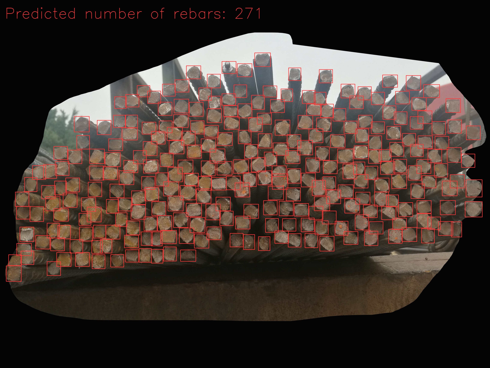
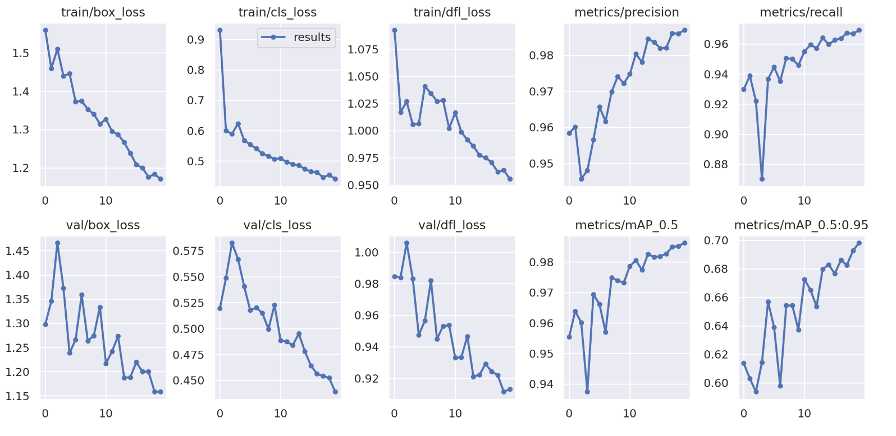

# RebarCounter-YOLOV9

### [Xin Yao](https://xinyaoict.github.io/) 

 


This is a repository that implements rebar detection and counting using YOLOv9, which is the newest state-of-the-art object counting and detection model which was published very recently.

The jupyter notebook file `YOLOv9_RebarCounting.ipynb` includes everything needed for downloading datasets, training, and testing.

The Rebar dataset is available at https://github.com/Armin1337/RebarDSC

The original YOLO-v9 code repo at https://github.com/WongKinYiu/yolov9

If you have any questions, please feel free to contact me at xin.yao.ict@gmail.com.


### 1. Download YOLOv9 from Github and install required packages
```bash
!git clone git@github.com:WongKinYiu/yolov9.git # or https://github.com/WongKinYiu/yolov9.git
%cd yolov9
!pip install -r requirements.txt -q
!pip install Pillow==9.5.0 # Install pillow with this version to avoid a warning later
import os
HOME = os.getcwd() # define a home directory
!mkdir -p {HOME}/weights
!wget -P {HOME}/weights -q https://github.com/WongKinYiu/yolov9/releases/download/v0.1/yolov9-c.pt
!wget -P {HOME}/weights -q https://github.com/WongKinYiu/yolov9/releases/download/v0.1/yolov9-e.pt
!wget -P {HOME}/weights -q https://github.com/WongKinYiu/yolov9/releases/download/v0.1/gelan-c.pt
!wget -P {HOME}/weights -q https://github.com/WongKinYiu/yolov9/releases/download/v0.1/gelan-e.pt
```

### 2. Download the Rebar dataset
```bash
!gdown 1-rRbIP2ds0zSjcI8j8o1ERm3ethAAiZr -O RebarDSC.zip
!unzip -q RebarDSC.zip -d RebarDSC
!rm RebarDSC.zip
!pip install gdown # install gdown to download files from Google Drive
```

### 3. Convert the Rebar dataset to YOLO format
This is the key step to train YOLO on a new dataset. I converted the rebar dataset to align it with the formats used in YOLO.
```python
import numpy as np
import cv2
import os
import csv
from collections import defaultdict
import shutil

data_folder_old = 'RebarDSC'

path_train = os.path.join(data_folder_old, 'annotations/100_percent_train.csv')
path_test = os.path.join(data_folder_old, 'annotations/test.csv')

dict_train = defaultdict(list)
dict_test = defaultdict(list)

with open(path_train, 'r') as f:
    reader = csv.reader(f)
    for row in reader:
        image_path = row[0]
        x1, y1, x2, y2  = row[1].split()
        x1, y1, x2, y2 = int(x1), int(y1), int(x2), int(y2)
        dict_train[image_path].append([x1, y1, x2, y2])
# get 1125 images for training

with open(path_test, 'r') as f:
    reader = csv.reader(f)
    for row in reader:
        image_path = row[0]
        x1, y1, x2, y2  = row[1].split()
        x1, y1, x2, y2 = int(x1), int(y1), int(x2), int(y2)
        dict_test[image_path].append([x1, y1, x2, y2])
# get 1000 images for testing

datafolder_new = 'rebar_data'

for phase in ['train', 'test']:
    phase_folder = os.path.join(datafolder_new, phase)
    img_folder = os.path.join(phase_folder, 'images')
    if not os.path.exists(img_folder):
        os.makedirs(img_folder)
    label_folder = os.path.join(phase_folder, 'labels')
    if not os.path.exists(label_folder):
        os.makedirs(label_folder)

    dict_data = dict_train if phase == 'train' else dict_test
    
    for image_path in dict_data.keys():
        new_image_path = os.path.join(img_folder, image_path)
        os.rename(os.path.join(data_folder_old, 'images',image_path), new_image_path)

        img = cv2.imread(new_image_path)
        height, width, _ = img.shape
        bounding_box_list = dict_data[image_path]
        for bounding_box in bounding_box_list:
            x1, y1, x2, y2 = bounding_box
            x_center = (x1 + x2) / 2
            y_center = (y1 + y2) / 2
            w = x2 - x1
            h = y2 - y1
            x_center = x_center / width
            y_center = y_center / height
            w = w / width
            h = h / height
            with open(os.path.join(label_folder, image_path.replace('.jpg', '.txt')), 'a') as f:
                f.write('0 %f %f %f %f\n' % (x_center, y_center, w, h))
shutil.rmtree(data_folder_old)
```

Besides, we should include a `data.yaml` file that tells YOLO what classes are included in the dataset and where the train/val/test data are:
```yaml
%%file rebar_data/data.yaml
names:
- rebar
nc: 1
rebar:
  project: rebar-detection
test: rebar_data/test/images
train: rebar_data/train/images
val: rebar_data/test/images
```
### 4. Train the model using our own dataset and the pretrained weights

Now we can train our model using the pretrained models. Here I used the new proposed lightweight network GELAN (Generalized Efficient Layer Aggregation Network) in the YOLOv9 project as an example.
Due to GPU storage limitation, I set batch size as 2.

```bash
!python train.py \
        --batch 2 --epochs 20 --img 640 --device 0 --min-items 0 --close-mosaic 15 \
        --data rebar_data/data.yaml \
        --weights weights/gelan-c.pt \
        --cfg models/detect/gelan-c.yaml \
        --hyp hyp.scratch-high.yaml
```

### 5. Examine training results
Now we can examine the training results by showing the plotted training/validation loss and metrics during training.
```bash
from IPython.display import Image
Image(filename=f"{HOME}/runs/train/exp/results.png", width=1000)
```


### 6. Testing the new YOLOv9 model on the Rebar testset

Now let's get the results of the Rebar testset!

I modified some codes in `detect.py` to better visualize the results and calculate the counting accuracy.

Please directly download from Google Drive and overwrite the original `detect.py`.

```bash
! gdown 1-xbhirSLrIvFGxnJS0G8TngJy872CIFU
```

Run let's run the new `detect.py` file to get all the results.

Please remember to set the experiment ID, corresponding to the training procedure above, in `--weights runs/train/<expID>/weights/best.pt`.

After running through all the 1000 test images. You should be able to get an accuracy around 98%.

```bash
!python detect.py \
	--img 640 --conf-thres 0.5 --device 0 \
	--weights runs/train/exp/weights/best.pt \
	--source rebar_data/test/images\
	--line-thickness 2 \
	--hide-labels \
	--save-txt
```

### 7. Visualize the test results
Now we can visualize some predicted images to understand how the result looks.
Please note the `expID` in `/runs/detect/expID/*.jpg'` is not necessarily the same as the ID number used in training. Set the correct one created in the testing procedure.

```python
import glob
from IPython.display import Image, display

for image_path in glob.glob(f'{HOME}/runs/detect/exp/*.jpg')[:4]:
      display(Image(filename=image_path, width=600))
      print("\n")
```

### 8. Conclusion
Compared to Faster R-RCNN, which was proposed in 2015, the new YOLOv9 published this week has achieved much better results in terms of prediction accuracy and inference time.
