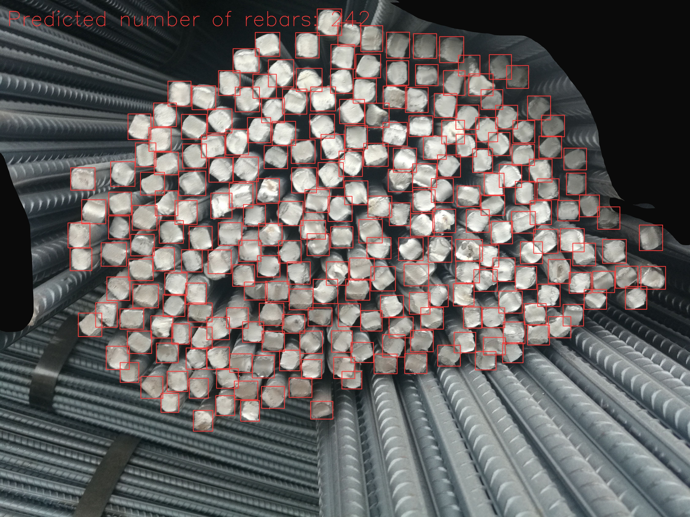

# RebarCounter-YOLOV9

### [Xin Yao](https://xinyaoict.github.io/) 

 

This is a repository that implements rebar detection and counting using YOLOv9, which is the newest state-of-the-art object counting and detection model which was published very recently.

The jupyter notebook file `YOLOv9_RebarCounting.ipynb` includes everything needed for downloading datasets, training, and testing.

The Rebar dataset is available at https://github.com/Armin1337/RebarDSC

The original YOLO-v9 code repo at https://github.com/WongKinYiu/yolov9

If you have any questions, please feel free to contact me at xin.yao.ict@gmail.com.
